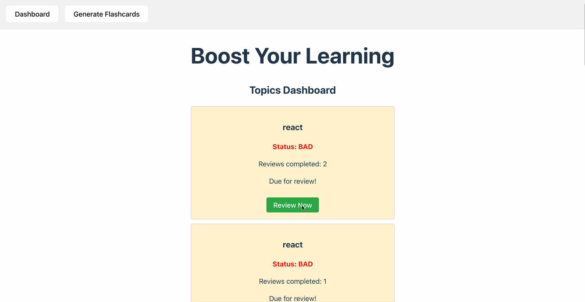

# BetterLearn

## Overview

BetterLearn is a learning app designed to help people learn efficiently using spaced repetition and quick, adaptive AI-generated tests. The app leverages AI to generate flashcards and quizzes, and uses proven spaced repetition techniques to maximize retention.

## Currrent State:

## Problem: How do we learn? 

### The Science Behind BetterLearn

Most people forget new information quickly after learning it—a phenomenon described by the "forgetting curve," first studied by psychologist Hermann Ebbinghaus in the late 19th century. The forgetting curve shows that memory retention drops steeply soon after learning, unless the information is reviewed at strategic intervals.

**Spaced Repetition** is a learning technique that counters the forgetting curve by scheduling reviews just before you are likely to forget. Neuroscience research shows that repeated, spaced retrieval strengthens neural connections, making memories more durable and easier to recall.

**The Testing Effect** is another powerful principle: actively recalling information (testing yourself) is far more effective for long-term retention than passive review. Studies in cognitive psychology and neuroscience demonstrate that retrieval practice not only reinforces memory but also improves the ability to apply knowledge in new situations.

**BetterLearn** combines these principles—spaced repetition and active recall—using AI to generate personalized quizzes and flashcards, helping you learn more efficiently and remember longer.

**References:**
- Ebbinghaus, H. (1885). Memory: A Contribution to Experimental Psychology.
- Roediger, H. L., & Karpicke, J. D. (2006). Test-enhanced learning: Taking memory tests improves long-term retention. Psychological Science, 17(3), 249-255.
- Karpicke, J. D., & Blunt, J. R. (2011). Retrieval practice produces more learning than elaborative studying with concept mapping. Science, 331(6018), 772-775.

## Features

- AI-generated flashcards and quizzes for any topic
- ⏰ Spaced repetition scheduling for optimal review
- 📊 Progress tracking and review analytics

## How It Works

1. Enter a topic you want to learn.
2. The AI generates flashcards and multiple-choice questions.
3. Review and test yourself. The app schedules reviews using spaced repetition.
4. Track your progress and improve over time!

## Tech Stack

- **Frontend:** React, TypeScript
- **Backend:** FastAPI, Python, Google Generative AI
- **Database:** PostgreSQL

## Getting Started

### Prerequisites

- Node.js & npm (for frontend)
- Python 3.9+ (for backend)
- PostgreSQL (for data storage)