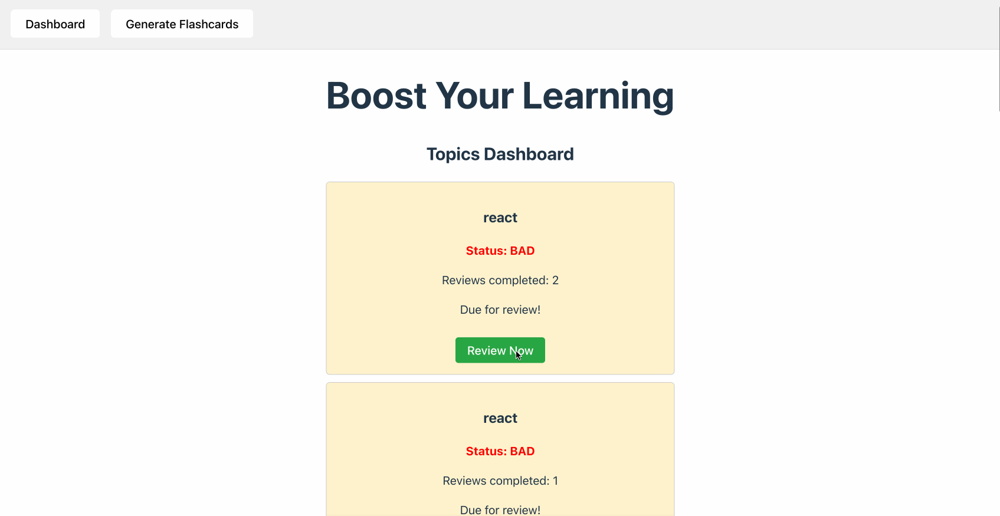
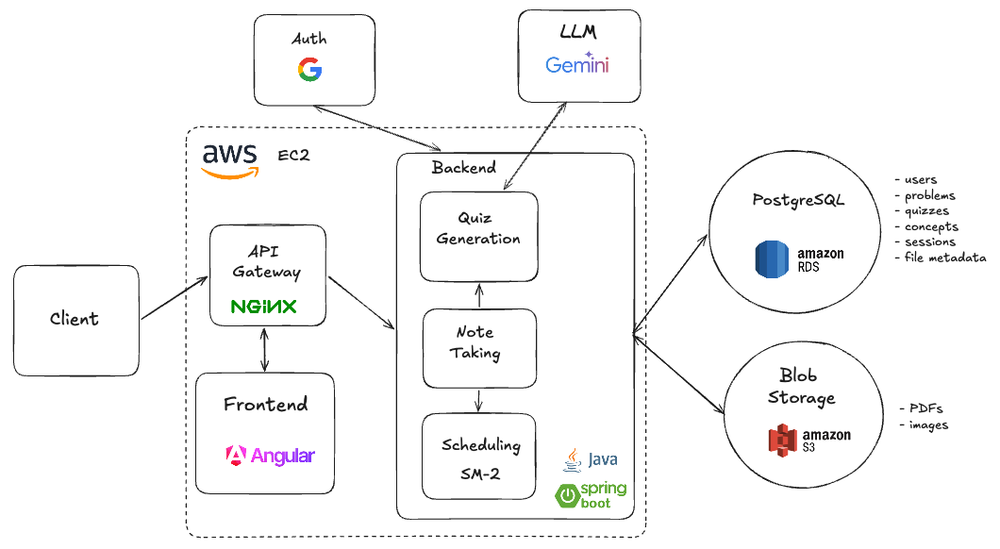

[](https://github.com/bshiribaiev/betterlearn/graphs/contributors)
[](https://github.com/bshiribaiev/betterlearn/stargazers)
[](https://github.com/bshiribaiev/betterlearn/issues)
[](https://linkedin.com/in/bshiribaiev)

<div align="center">
  <h3>BetterLearn</h3>
  <p>Spaced repetition learning app with notes, AI-generated quizzes/flashcards, and LeetCode tracking.<br/>Built to actually retain what you study.</p>
  <a href="https://betterlearn.app">Visit</a> ·
  <a href="https://github.com/bshiribaiev/betterlearn/issues">Report Bug</a> ·
  <a href="https://github.com/bshiribaiev/betterlearn/issues">Request Feature</a>
</div>

<br/>

<div align="center">
  
</div>

<details>
  <summary>Table of Contents</summary>

  - [What it does](#what-it-does)
  - [Tech Stack](#tech-stack)
  - [Architecture](#architecture)
  - [Key Design Decisions](#key-design-decisions)
  - [Project Structure](#project-structure)
  - [Local Development](#local-development)
  - [API](#api)
</details>

## What it does

- **Notes + Quizzes** — Write notes on any topic. Gemini generates multiple-choice quizzes from your notes. Spaced repetition schedules reviews based on how well you did.
- **Flashcards** — Define terms in your notes and review them as flashcards. Mark correct/wrong, SM-2 auto-schedules the next review.
- **LeetCode Tracker** — Paste a LeetCode URL, rate your recall after each review. SM-2 handles the scheduling so you never forget a problem.
- **Vocabulary** — Add words, get AI-generated definitions, review with spaced repetition.
- **Dashboard** — See everything that's due today across all modules in one place.

## Tech Stack

| Layer | Tech |
|-------|------|
| Frontend | Angular 19 (standalone components), Tailwind CSS |
| Backend | Java 21, Spring Boot 3, Spring Security + JWT |
| Database | PostgreSQL 16, Spring Data JPA, Flyway migrations |
| AI | Google Gemini 2.5 Flash (quiz/flashcard generation) |
| Storage | AWS S3 (image uploads) |
| Auth | JWT + Google OAuth 2.0 |
| Infra | AWS EC2, RDS, S3, nginx, Let's Encrypt SSL |

## Architecture



## Key Design Decisions

- **SM-2 Algorithm** — Industry-standard spaced repetition (same as Anki). Quality scores map to review intervals: fail resets, success extends. EF floor at 1.3.
- **Stale-while-revalidate** — All list pages show cached data instantly from localStorage, then refresh in the background. Dashboard feels instant despite 8+ DB queries.
- **Feature-based packages** — Each module (auth, leetcode, quiz, vocabulary) owns its controller, service, repository, and DTOs. No cross-module dependencies.
- **Dynamic quiz generation** — Question count scales with note length (3-10 questions). Gemini generates structured JSON, backend validates and stores.

## Project Structure

```
backend/src/main/java/com/betterlearn/
  auth/           Auth, JWT, Google OAuth
  leetcode/       Problem tracker + review history
  quiz/           Topics, concepts, notes, quiz generation
  vocabulary/     Word groups, term quizzes
  dashboard/      Aggregated due items + stats
  srs/            SM-2 algorithm (pure, stateless)
  config/         Security, CORS, Gemini, S3

frontend/src/app/
  core/           Auth interceptor, guard, service
  features/       auth/, dashboard/, leetcode/, quiz/, vocabulary/
  shared/         Navbar, cached-fetch, pipes
```

## Local Development

```bash
# Postgres
docker compose -f docker-compose.dev.yml up -d

# Backend (port 8080)
cd backend
cp .env.example .env    # fill in GEMINI_API_KEY, Google OAuth keys
./mvnw spring-boot:run

# Frontend (port 4200, proxies /api to backend)
cd frontend
npm install
npx ng serve
```

## API

| Module | Endpoints |
|--------|-----------|
| Auth | `POST /api/auth/register`, `POST /api/auth/login`, `GET /api/auth/me`, `GET /api/auth/google` |
| LeetCode | `GET/POST /api/leetcode`, `POST /api/leetcode/:id/review`, `PATCH /api/leetcode/:id/reschedule` |
| Quiz | `GET/POST /api/quiz/topics`, `GET/POST /api/quiz/concepts`, `POST /api/quiz/topics/:id/generate`, `POST /api/quiz/topics/:id/submit` |
| Vocabulary | `GET/POST /api/vocabulary/topics/:id/words`, `POST /api/vocabulary/words/:id/review` |
| Dashboard | `GET /api/dashboard` |
